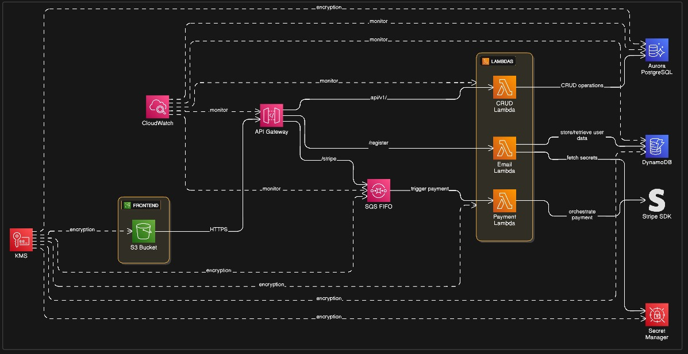

# 📘 README — Arquitetura Geral do Projeto do TCC - SOLIDARIO+

Este repositório contém a documentação completa da arquitetura do sistema desenvolvido para o Trabalho de Conclusão de Curso (TCC). Aqui você encontrará a visão geral, componentes, tecnologias, diagramas e links para cada parte da solução.

---

## 🏗️ Visão Geral da Arquitetura

A arquitetura do SOLIDARIO+ foi projetada para ser altamente escalável, resiliente e financeiramente eficiente, seguindo princípios modernos de design e boas práticas recomendadas pela AWS. A solução é composta pelos seguintes módulos principais:

* **Front-end:** Interface web utilizada pelos usuários e administradores, hospedada na Vercel.
* **Back-end (API Serverless):** Conjunto de serviços Lambda responsáveis pelas regras de negócio, orquestração de processos e comunicação com o banco de dados.
* **Banco de Dados:** Utilização de Amazon Aurora Serverless v2 para garantir disponibilidade, elasticidade e performance.
* **Serviços AWS:** Conjunto de serviços gerenciados utilizados para processamento, mensageria, armazenamento e APIs.
* **Autenticação:** Implementada seguindo boas práticas de segurança e princípios de identidade.

Para o Back-end, optou-se por uma arquitetura **event-driven e totalmente serverless**, atendendo aos requisitos de escalabilidade automática, baixo custo e independência entre componentes. Essa abordagem permite que cada serviço seja executado apenas quando necessário, reduzindo custos ociosos e ampliando a performance em momentos de alta demanda.

Além disso, a estratégia event-driven contribui para aumentar a resiliência da solução. Com serviços desacoplados e escaláveis, é possível distribuir a carga de trabalho em diferentes regiões da AWS, reduzindo riscos de indisponibilidade e alinhando o projeto aos pilares do **AWS Well-Architected Framework**, especialmente em **Confiabilidade**, **Excelência Operacional** e **Otimização de Custos (FinOps)**.

---

## 📐 Diagrama da Arquitetura

*O S3 está servindo como representatividade da vercel, pois nao achamos ícone na ferramenta que utilizamos para diagramar a arquitetura

---

## 📁 Repositórios do Projeto
Aqui estão os repositórios individuais da solução:

**🔹 Front-end:**  https://github.com/Saulog3/igreja-amor-doar

**🔹 Back-end:**

*Serviços de backend, no mesmo repositório está a infra em terraform deles.

🧩 Serviço de E-mail (AWS Lambda): https://github.com/JulioH-dot/lambda-servico-email-solidario-mais

🧩 Serviço de Processar pagamento (AWS Lambda): https://github.com/JulioH-dot/lambda-process-payment

🧩 Serviço de CRUD (AWS Lambda): https://github.com/JulioH-dot/lambda-crud-solidario-mais

**🔹 Infraestrutura do Banco de Dados:** https://github.com/JulioH-dot/infra-db-solidario-mais

---

## ⚙️ Tecnologias Utilizadas

**Linguagens:**

* TypeScript / JavaScript
* Python

**Frameworks:**

* React

**Banco de Dados:**

* PostgreSQL

**Cloud AWS:**

* Lambda
* API Gateway
* S3
* DynamoDB
* IAM
* CloudWatch
* KMS
* Secret Manager
* Aurora RDS
* SQS

**Hospedagem:**

* Vercel

**Gateway de Pagamento:**

* Stripe
---

## 🔄 Fluxo de Funcionamento

Um fluxo típico da aplicação segue os seguintes passos:

1. O usuário acessa o front-end e realiza uma requisição.
2. O front-end envia a requisição para a API hospedada na AWS.
3. A API valida os dados e executa as regras de negócio.
4. A API consulta / grava dados no banco de dados.
5. A resposta retorna para o front-end.
6. O usuário visualiza o resultado em tela.

---

## 🧪 Testes

* Testes de integração nos endpoints.
* Testes manuais em ambiente de desenvolvimento.

---

## 🚀 Como Executar Localmente

1. Clone os repositórios necessários:

```bash
git clone https://github.com/Saulog3/igreja-amor-doar
```

2. Instale as dependências:

```bash
npm install
```

4. Execute cada serviço:

```bash
npm run dev
```
